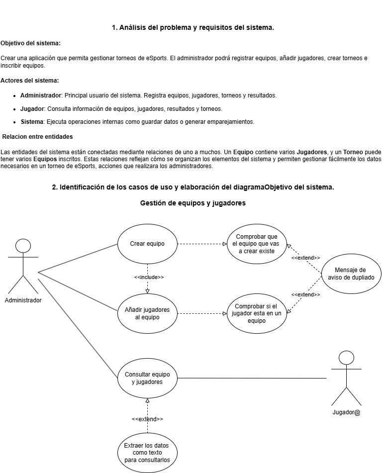
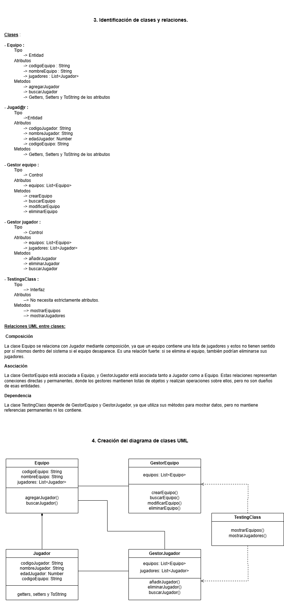

# Sistema de Gestión de Torneos de eSports

## Autor
Manu Domínguez Navarro  
[GitHub: mdomingueznavarro](https://github.com/mdomingueznavarro)

## Descripción del Proyecto
Este proyecto implementa un sistema de gestión de torneos de eSports utilizando UML para el modelado estructural y funcional. La parte práctica consiste en el diseño del sistema a través de los diagramas de casos de uso y de clases.

## Diagramas UML

### Diagrama de Casos de Uso

### Diagrama de Clases

## Estructura del Proyecto
torneo-esports-uml/ ├── src/ │ └── es/ │ └── empresa/ │ └── torneo/ │ ├── modelo/ │ ├── control/ │ ├── vista/ │ └── Main.java ├── diagrams/ │ ├── casos-uso.png │ └── clases.png ├── README.md

## Justificación del diseño

Se han aplicado correctamente los principios de la Programación Orientada a Objetos (POO) y UML:

- **Casos de uso**: Se han definido las funcionalidades clave del sistema como "Crear equipo", "Añadir jugador", "Consultar equipos y jugadores", y se han incorporado relaciones `<<include>>` y `<<extend>>` para evitar repeticiones y reflejar acciones opcionales como exportar datos o mostrar avisos de duplicados.
  
- **Clases**: Se han identificado clases de tipo **Entidad** (`Equipo`, `Jugador`), **Control** (`GestorEquipo`, `GestorJugador`) y **Interfaz** (`TestingClass`), asignando atributos y métodos según su responsabilidad.

- **Relaciones UML**: 
  - Se ha usado **composición** entre `Equipo` y `Jugador`, ya que los jugadores forman parte de un equipo.
  - Se han modelado **asociaciones** entre los gestores y sus clases gestionadas.
  - Se ha representado **dependencia** entre `TestingClass` y los gestores, ya que solo los utiliza de forma puntual.

Esta estructura modular permite mantener el código organizado y escalable.

## Conclusiones

A través de este proyecto he comprendido mejor cómo aplicar la programación orientada a objetos al diseño de sistemas reales, utilizando diagramas UML para visualizar tanto la funcionalidad como la estructura. He aprendido a distinguir clases por su función (entidad, control, interfaz), a representar relaciones entre ellas y a documentar de forma clara y estructurada el sistema.

Este trabajo me ha permitido consolidar mis conocimientos sobre análisis y diseño orientado a objetos, y me prepara para futuras etapas de implementación en Java.